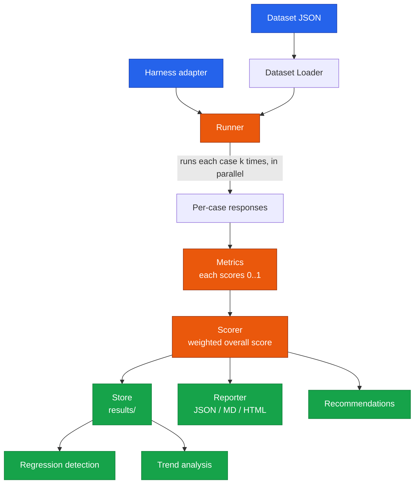

# Architecture

## Overview

This framework evaluates an AI harness — the layer that orchestrates prompts,
models, tools, and retries — by running it against a dataset of test cases and
scoring the responses across several dimensions. It does not build a harness;
it measures one.

The design separates *what a harness is* from *how we evaluate it*, so any
harness that conforms to a small interface can be benchmarked, and any new
metric can be added without touching the runner.

## Component flow

## Modules

| Module | Responsibility |
| --- | --- |
| `models.py` | Pydantic data contracts: `TestCase`, `HarnessResponse`, `MetricResult`. Everything else speaks these types. |
| `harness.py` | The `Harness` interface plus a `MockHarness` so the framework runs offline. Real harnesses subclass `Harness`. |
| `dataset.py` | Loads and validates a JSON dataset into `TestCase` objects. |
| `metrics/` | One file per metric. Each registers itself via a decorator into a central registry. |
| `runner.py` | Executes the dataset against the harness, `k` repeats per case, in a thread pool; scores every registered metric. |
| `scorer.py` | Collapses per-case metrics into one weighted overall score; collects failed cases; generates recommendations. |
| `store.py` | Persists each run as timestamped JSON so runs can be listed and compared. |
| `reporter.py` | Renders a scored run as JSON, Markdown, and HTML from a single source dict. |
| `cli.py` | Command-line entry point: `run`, `list`, `compare`, `report`. |

## Key design decisions

**Metric registry via decorators.** Each metric calls `@register` at import
time and lands in a central dict. The runner asks the registry for "all
metrics" rather than importing each one, so adding a metric is a single new
file — no changes to the runner or scorer. This directly serves the
extensibility requirement.

**Metrics score a *list* of responses, not one.** Every case is run `k` times.
This is what lets consistency measure agreement across runs and lets latency
report a p95 percentile instead of a single sample. It costs more calls, but
reliability is meaningless from one run.

**All metrics normalise to 0..1, higher-is-better.** Raw units differ
(seconds, tokens, dollars), so each metric maps its measurement onto a 0..1
scale. Only this makes a single weighted overall score meaningful. Each metric
also keeps its raw `value` for transparency.

**Skip, don't penalise, inapplicable metrics.** A correctness check on a case
with no expected answer, or a tool check on a case with no expected tools,
returns 1.0 and a note — not 0.0. Otherwise every dataset would have to specify
every field for every case. Applicability is a property of the case, not a
failure of the harness.

**Harness as a pluggable adapter.** The framework depends only on the `Harness`
interface. A real system is evaluated by wrapping it in a subclass; the mock
lets the whole pipeline run without network or cost. The CLI keeps a small
registry of harnesses so a new one is one line.

**Single source of truth for reports.** JSON, Markdown, and HTML are all built
from one `_report_dict()`. The formats can never drift out of sync.

## Threading choice

Harness calls are I/O-bound (network latency dominates), so the runner uses a
thread pool. Threads overlap the waiting without process overhead. If scoring
were CPU-heavy, processes would be the better choice — but scoring is cheap
compared to the calls themselves.

## Trade-offs and what I'd add next

- **Storage is file-per-run JSON.** Simple, inspectable, diffable. A production
  system would move to a database, but the `save/list/load` interface would
  stay the same.
- **Correctness uses fuzzy string matching.** Good enough for short factual
  answers; for open-ended text I'd add semantic similarity or an LLM-as-judge
  metric — which the registry makes easy to drop in.
- **Structured-output check is key-presence, not full JSON-Schema.** Catches
  the common failures; full schema validation is the natural next step.